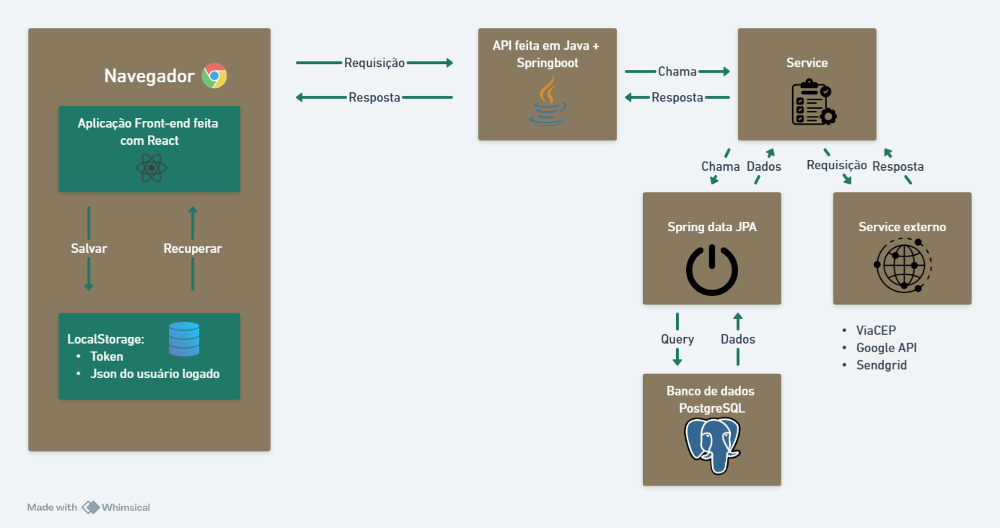
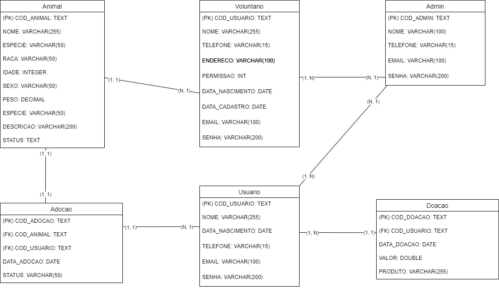

## 4. Projeto da Solução

Pré-requisitos: <a href="03-Modelagem do Processo de Negocio.md"> Modelagem do Processo de Negocio</a>

## 4.1. Arquitetura da solução

Passo a passo do funcionamento do projeto:

- O usuário interage com a aplicação feita em React;
- A aplicação react se comunica com a api feita em Java, enviando uma request com os parâmetros e configurações necessários;
- A camada de controller da api faz uma chamada ao service necessário;
- O service solicita faz uma requisição ao banco de dados através do JPA ou faz uma chamada a algum service externo;
- O service responde ao chamado do controller com o que foi solicitado ou lançará uma exceção caso algo tenha dado errado no processamento;
- O controller trata a exceção e fornece a resposta adequada ao cliente, com base no que ocorreu durante o tratamento;
- A aplicação react recebe a resposta da api e renderiza a tela conforme esta resposta

Módulos:
- Navegador Web onde estará rodando a aplicação front-end;
- Aplicação front-end feita em React;
- LocalStorage;
- API em Java;
- Services internos;
- Services externos;
- ORM JPA;
- Banco de dados PostgreSQL;
 
 **Diagrama da arquitetura de solução**:
 
 
 
## 4.1.1 Processos

Modelo AS IS
Processo 1: Recebimento de Animais Resgatados e Adoção Temporária
- Animais resgatados são recebidos pela ONG.
- A ONG seleciona um dos voluntários cadastrados para oferecer um lar temporário ao animal.
- O voluntário escolhido se compromete a arcar com todos os custos relacionados ao animal, incluindo alimentação e cuidados médicos.

Processo 2: Recebimento e Revenda de Doações
- A ONG realiza a montagem de barracas para a coleta de doações, em eventos previamente marcados e divulgados.
- As doações recebidas são submetidas a um processo de triagem, no qual itens reutilizáveis são separados dos que não possuem condições de reuso.
- Os produtos reutilizáveis são precificados pela ONG e revendidos para arrecadar fundos destinados às atividades da organização.
- Itens que não podem ser reaproveitados são descartados de maneira sustentável.

Processo 3: Feiras de Castração e Eventos Relacionados
- A ONG organiza feiras de castração e outros eventos de conscientização e apoio aos animais.
- O primeiro passo é a marcação de uma data adequada para o evento, considerando logística e divulgação.
- A ONG então realiza a divulgação do evento por meio de canais apropriados (redes sociais, parcerias locais, entre outros).
- Durante o evento, os procedimentos veterinários são realizados, como castração de animais, com todo o suporte técnico necessário.
- A arrecadação de fundos ou doações durante o evento também pode ocorrer, complementando as ações de apoio da ONG.
  
Modelo TO BE
Processo 1: Recebimento de Animais Resgatados e Adoção Temporária
- Ao receber os animais resgatados, a ONG utiliza um sistema digital de registro para catalogar dados sobre o animal, como espécie, idade e estado de saúde.
- A seleção de voluntários para o lar temporário é automatizada por meio de um sistema que sugere os voluntários mais adequados, com base na disponibilidade e histórico de cuidados.
- A ONG desenvolve parcerias com clínicas veterinárias e pet shops, oferecendo subsídios para alimentação e cuidados médicos dos animais, reduzindo a carga financeira para os voluntários.
- O acompanhamento do estado do animal é feito regularmente por meio de um sistema de relatórios online, preenchidos pelos voluntários.

Processo 2: Recebimento e Revenda de Doações 
- Os eventos de coletas são cadastrados e integrados ao site e fica disponível para visualização dos colaboradores e voluntários.
- Os itens coletados passam por um processo de triagem e categorizados.
- Os itens são precificados automaticamente com base em uma tabela-padrão.
- Os itens descartados são registrados e direcionados para  programas de reciclagem.

Processo 3: Feiras de Castração e Eventos Relacionados
- As feiras de castração e outros eventos são planejados com antecedência por meio de um sistema de gestão de eventos, que permite agendar datas, enviar notificações automáticas para voluntários e participantes, e ajustar a logística.
- A divulgação é realizada em múltiplos canais simultaneamente.
- As inscrições para castração são feitas online, facilitando o controle de vagas e a gestão do evento.
- Durante o evento, o atendimento é otimizado com um sistema de fila digital, que organiza os horários dos procedimentos, reduzindo o tempo de espera.
- Além da arrecadação de doações durante o evento, parcerias com empresas locais podem ser promovidas, permitindo a doação de produtos e serviços para fortalecer o suporte à ONG.

### 4.2. Protótipos de telas

Visão geral da interação do usuário pelas telas do sistema e protótipo interativo das telas com as funcionalidades que fazem parte do sistema (wireframes).
Apresente as principais interfaces da plataforma. Discuta como ela foi elaborada de forma a atender os requisitos funcionais, não funcionais e histórias de usuário abordados nas <a href="02-Especificação do Projeto.md"> Especificação do Projeto</a>.
A partir das atividades de usuário identificadas na seção anterior, elabore o protótipo de tela de cada uma delas.

São protótipos usados em design de interface para sugerir a estrutura de um site web e seu relacionamentos entre suas páginas. Um wireframe web é uma ilustração semelhante do layout de elementos fundamentais na interface.
 
> **Links Úteis**:
> - [Protótipos vs Wireframes](https://www.nngroup.com/videos/prototypes-vs-wireframes-ux-projects/)
> - [Ferramentas de Wireframes](https://rockcontent.com/blog/wireframes/)
> - [MarvelApp](https://marvelapp.com/developers/documentation/tutorials/)
> - [Figma](https://www.figma.com/)
> - [Adobe XD](https://www.adobe.com/br/products/xd.html#scroll)
> - [Axure](https://www.axure.com/edu) (Licença Educacional)
> - [InvisionApp](https://www.invisionapp.com/) (Licença Educacional)

## Diagrama de Classes

O diagrama de classes ilustra graficamente como será a estrutura do software, e como cada uma das classes da sua estrutura estarão interligadas. Essas classes servem de modelo para materializar os objetos que executarão na memória.

As referências abaixo irão auxiliá-lo na geração do artefato “Diagrama de Classes”.

> - [Diagramas de Classes - Documentação da IBM](https://www.ibm.com/docs/pt-br/rational-soft-arch/9.6.1?topic=diagrams-class)
> - [O que é um diagrama de classe UML? | Lucidchart](https://www.lucidchart.com/pages/pt/o-que-e-diagrama-de-classe-uml)

## Modelo ER

O Modelo ER representa através de um diagrama como as entidades (coisas, objetos) se relacionam entre si na aplicação interativa.]

As referências abaixo irão auxiliá-lo na geração do artefato “Modelo ER”.

> - [Como fazer um diagrama entidade relacionamento | Lucidchart](https://www.lucidchart.com/pages/pt/como-fazer-um-diagrama-entidade-relacionamento)

### 4.3. Modelo de dados

O desenvolvimento da solução proposta requer a existência de bases de dados que permitam efetuar os cadastros de dados e controles associados aos processos identificados, assim como recuperações.
Utilizando a notação do DER (Diagrama Entidade e Relacionamento), elaborem um modelo, na ferramenta visual indicada na disciplina, que contemple todas as entidades e atributos associados às atividades dos processos identificados. Deve ser gerado um único DER que suporte todos os processos escolhidos, visando, assim, uma base de dados integrada. O modelo deve contemplar, também, o controle de acesso de usuários (partes interessadas dos processos) de acordo com os papéis definidos nos modelos do processo de negócio.
_Apresente o modelo de dados por meio de um modelo relacional que contemple todos os conceitos e atributos apresentados na modelagem dos processos._

#### 4.3.1 Modelo ER

O Modelo ER representa através de um diagrama como as entidades (coisas, objetos) se relacionam entre si na aplicação interativa.]

As referências abaixo irão auxiliá-lo na geração do artefato “Modelo ER”.

> - [Como fazer um diagrama entidade relacionamento | Lucidchart](https://www.lucidchart.com/pages/pt/como-fazer-um-diagrama-entidade-relacionamento)

#### 4.3.2 Esquema Relacional

O Esquema Relacional corresponde à representação dos dados em tabelas juntamente com as restrições de integridade e chave primária.
 
As referências abaixo irão auxiliá-lo na geração do artefato “Esquema Relacional”.

> - [Criando um modelo relacional - Documentação da IBM](https://www.ibm.com/docs/pt-br/cognos-analytics/10.2.2?topic=designer-creating-relational-model)

---

#### 4.3.3 Modelo Físico

Insira aqui o script de criação das tabelas do banco de dados.

Veja um exemplo:

<code>

CREATE TABLE Admin (
    id VARCHAR(255) PRIMARY KEY,
    name VARCHAR(255) NOT NULL,
    sobrenome VARCHAR(255),
    email VARCHAR(255) NOT NULL,
    ddd INT,
    telefone INT,
    rua VARCHAR(255),
    bairro VARCHAR(255),
    cidade VARCHAR(255),
    cep INT,
    senha VARCHAR(255) NOT NULL
);

-- Tabela Usuario
CREATE TABLE Usuario (
    id VARCHAR(255) PRIMARY KEY,
    email VARCHAR(255) NOT NULL,
    nome VARCHAR(255) NOT NULL,
    senha VARCHAR(255) NOT NULL,
    ddd INT,
    telefone INT
);

-- Tabela Voluntario
CREATE TABLE Voluntario (
    id VARCHAR(255) PRIMARY KEY,
    name VARCHAR(255) NOT NULL,
    sobrenome VARCHAR(255),
    email VARCHAR(255) NOT NULL,
    ddd INT,
    telefone INT,
    rua VARCHAR(255),
    bairro VARCHAR(255),
    cidade VARCHAR(255),
    cep INT,
    senha VARCHAR(255) NOT NULL
);

-- Tabela Produto
CREATE TABLE Produto (
    id VARCHAR(255) PRIMARY KEY,
    preco DOUBLE NOT NULL,
    estado ENUM('NOVO', 'USADO') NOT NULL
);

-- Tabela Doacao
CREATE TABLE Doacao (
    id VARCHAR(255) PRIMARY KEY,
    data DATETIME NOT NULL,
    doador_id VARCHAR(255) NOT NULL,
    valor DOUBLE NOT NULL,
    FOREIGN KEY (doador_id) REFERENCES Usuario(id)
);

-- Tabela Animal
CREATE TABLE Animal (
    id VARCHAR(255) PRIMARY KEY,
    nome VARCHAR(255) NOT NULL,
    tipo VARCHAR(255) NOT NULL,
    raca VARCHAR(255),
    adotado BOOLEAN NOT NULL DEFAULT 0,
    tutor_id VARCHAR(255),
    idade INT,
    FOREIGN KEY (tutor_id) REFERENCES Voluntario(id)
);

-- Tabela Adocao
CREATE TABLE Adocao (
    id VARCHAR(255) PRIMARY KEY,
    animal_id VARCHAR(255) NOT NULL,
    adotante_id VARCHAR(255) NOT NULL,
    data DATE NOT NULL,
    FOREIGN KEY (animal_id) REFERENCES Animal(id),
    FOREIGN KEY (adotante_id) REFERENCES Usuario(id)
);
</code>

Este script deverá ser incluído em um arquivo .sql na pasta src\bd.

### 4.4. Tecnologias

_Descreva qual(is) tecnologias você vai usar para resolver o seu problema, ou seja, implementar a sua solução. Liste todas as tecnologias envolvidas, linguagens a serem utilizadas, serviços web, frameworks, bibliotecas, IDEs de desenvolvimento, e ferramentas._

Apresente também uma figura explicando como as tecnologias estão relacionadas ou como uma interação do usuário com o sistema vai ser conduzida, por onde ela passa até retornar uma resposta ao usuário.

| **Dimensão**   | **Tecnologia**  |
| ---            | ---             |
| SGBD           | PostgreSQL      |
| Front end      | React           |
| Back end       | Java SpringBoot |
| Deploy         | Render + Vercel |
| Wireframes     | Figma           |
| ORM            | Spring data JPA |
| IDE Back-end   | IntelliJ IDEA   |
| IDE Front-end  | VS Code         |
| Serviço emails | Sendgrid        |
| Mapa           | Google Maps api |
| Consulta CEP   | ViaCEP          |

