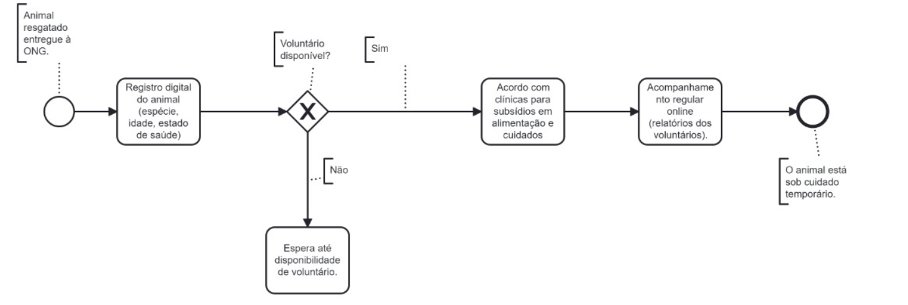

### 3.3.1 Processo 1 – Resgate e Adoção de Animais

_Apresente aqui o nome e as oportunidades de melhoria para o processo 1._  
Nome do Processo: **Resgate e Adoção de Animais**

Oportunidades de Melhoria:  
1. **Automatização do registro de animais**: Otimizar a entrada de dados no sistema digital, facilitando a catalogação de novas entradas.
2. **Integração com parcerias**: Implementar uma integração direta com clínicas veterinárias e pet shops para automatizar o envio de dados e redução da carga financeira.
3. **Aprimoramento da seleção de voluntários**: Melhorar o algoritmo de seleção, considerando mais variáveis como a localização geográfica e experiência com determinados tipos de animais.
4. **Relatórios de acompanhamento**: Simplificar o preenchimento de relatórios pelos voluntários e tornar as atualizações mais frequentes e detalhadas.

Em seguida, apresentamos o modelo do processo 1, descrito no padrão BPMN:

#### Detalhamento das atividades

_Descreva aqui cada uma das propriedades das atividades do processo 1._

**Nome da atividade 1: Registro de Animais Resgatados**

| **Campo**       | **Tipo**         | **Restrições**            | **Valor default** |
| ---             | ---              | ---                       | ---               |
| Espécie         | Caixa de Texto   | Obrigatório               |                   |
| Idade           | Número           | Valores de 0 a 20         |                   |
| Estado de saúde | Seleção única    | (Saudável, Doente, Outro)  |                   |
| Imagem          | Imagem           |                           |                   |

| **Comandos**         |  **Destino**                   | **Tipo**        |
| ---                  | ---                            | ---             |
| Registrar            | Fim do Processo 1              | default         |

**Nome da atividade 2: Seleção de Voluntário para Lar Temporário**

| **Campo**           | **Tipo**         | **Restrições**     | **Valor default** |
| ---                 | ---              | ---                | ---               |
| Nome do Voluntário  | Caixa de Texto   | Obrigatório        |                   |
| Disponibilidade     | Data e Hora      | dd-mm-aaaa, hh:mm  |                   |
| Histórico de Cuidados | Tabela          | Preenchimento Automático |               |

| **Comandos**         |  **Destino**                   | **Tipo**        |
| ---                  | ---                            | ---             |
| Selecionar Voluntário| Confirmação e Alocação         | default         |